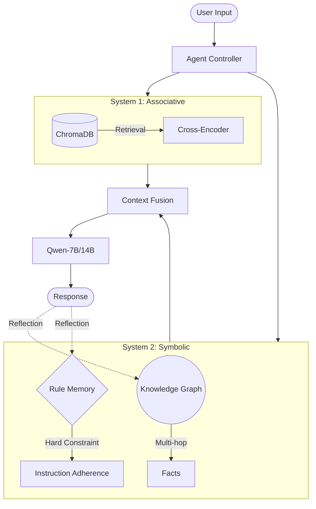

# Dual-Process Memory Augmented LLM
### Integrating Knowledge Graph and Reflection for Long-term Consistency

[](https://github.com/ByronDoeng/LLM_Memory)
[](https://www.python.org/)
[](https://pytorch.org/)

## 📖 简介 (Introduction)

本项目为复旦大学2025年秋季《模式识别与机器学习》期末PJ。

本项目旨在解决大语言模型 (LLM) 在长程对话中的“无状态”痛点，如**灾难性遗忘**和**指令依从性下降**。

借鉴认知科学中的**双重加工理论 (Dual-Process Theory)**，我们将智能体的记忆系统分为两个部分：
1. **System 1 (Associative Memory)**：利用向量数据库 (ChromaDB) 实现基于语义相似度的联想检索，提供记忆的广度。
2. **System 2 (Symbolic & Reflective Memory)**：利用知识图谱 (NetworkX) 维护精确事实链条，并通过反思机制 (Reflection) 实时提取并更新行为规则 (Rule Memory)，提供记忆的精度。

## ✨ 核心特性 (Key Features)

- **混合记忆架构**：三路召回机制（Vector + Graph + Rule），由动态 System Prompt 进行融合。
- **在线反思机制**：自动识别用户反馈（纠错、偏好、指令），实时更新规则库，避免“语义漂移”。
- **精排检索**：集成 Cross-Encoder 对向量记忆进行重排序，显著降低检索噪声。
- **自动评测流水线**：内置 `LLM-as-a-Judge` 评分机制，支持全自动化压力测试。
- **可视化分析**：深度集成 **Weights & Biases (WandB)**，实时监控记忆构建与评分趋势。

## 🏗 系统架构 (Architecture)



## 🚀 快速开始 (Quick Start)

### 1. 环境配置
建议使用 Conda 创建虚拟环境：
```bash
conda create -n llm_memory python=3.12
conda activate llm_memory
pip install -r requirements.txt
```

### 2. 准备测试数据集
使用我们提供的```./data/test_data.json```，或者自行准备测试集。

### 3. 运行自动化评测
进行消融实验（Ablation Study），对比全系统、纯 RAG、无记忆等方案的表现，并同步至 WandB：
```bash
python eval.py
```

## 📊 实验评估 (Evaluation)

我们采用了 **LLM-as-a-Judge** 机制，从两个维度进行量化评分：
- **Semantic Fact Recall (SFR)**: 评估回答与参考事实的语义覆盖度（0.0 - 1.0）。
- **Instruction Adherence Score (IAS)**: 评估模型对动态规则（如“禁止感叹号”、“对用户的特殊称呼”）的遵循程度。

### 实验结果展示
在 WandB 中可查看不同模块对模型性能的提升贡献：
- **Full System**: 在复杂实体链和硬约束测试中表现最稳健。
- **Vector Only**: 容易受到长文本噪声干扰，产生记忆混淆。
- **Rule Memory**: 显著提升了模型在受到“诱导性提问”时的抗干扰能力。

## 📂 文件结构 (File Structure)

```text
.
├── src/
│   ├── agent.py           # 智能体核心控制逻辑
│   ├── llm_engine.py      # 本地模型加载与推理引擎 (Qwen)
│   ├── memory_vector.py   # System 1: 向量检索模块
│   ├── memory_graph.py    # System 2: 知识图谱模块
│   ├── memory_rules.py    # System 2: 规则反思模块
│   └── memory_summary.py  # 长期记忆压缩与摘要
├── data/
│   └── test_data.json     # 自动化生成的评测数据集
├── eval.py                # 自动化评测与消融实验脚本
├── data_generate.py       # 高强度评测数据生成脚本
└── requirements.txt       # 项目依赖
```

## 📝 引用与致谢
本项目为课程《模式识别与机器学习》期末项目。感谢 [Weights & Biases](https://wandb.ai/) 提供的可视化平台支持。