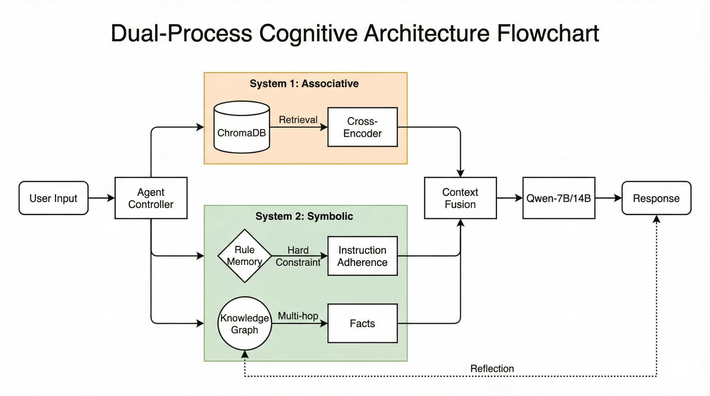

# Dual-Process Memory Augmented LLM
### Integrating Knowledge Graph and Reflection for Long-term Consistency

<!-- 项目徽章，显得专业 -->
[](https://www.fudan.edu.cn/)
[](./paper.pdf)
[](https://huggingface.co/Qwen/Qwen2.5-7B-Instruct)
[](LICENSE)

## 📖 简介 (Introduction)

> **复旦大学 2025 年秋季《模式识别与机器学习》期末 Project**

大语言模型 (LLM) 在长程交互中面临着“灾难性遗忘”和“指令依从性失效”的根本性挑战。传统的 RAG（检索增强生成）虽然扩展了上下文，但往往缺乏逻辑深度，且难以处理用户的否定性约束（Negative Constraints）。

本项目受认知科学中的**双重加工理论 (Dual-Process Theory)** 启发，提出了一种混合记忆架构：
*   **System 1 (Associative Memory)**：基于向量检索 (Vector Retrieval)，提供广泛的、直觉性的情境回忆。
*   **System 2 (Symbolic Memory)**：基于知识图谱 (Knowledge Graph) 和规则反思 (Rule Reflection)，提供精确的逻辑链条和严格的行为约束。

实验表明，该系统在长程对话中不仅消除了幻觉，还成功突破了“语义覆盖度”与“规则遵循度”之间的 Trade-off。

## 🏗 系统架构 (Architecture)

本系统由 Agent Controller 协调，动态融合三路召回流（Vector, Graph, Rule）。

<div align="center">
  
  <br>
  <em>Figure 1: Dual-Process Cognitive Architecture Flowchart</em>
</div>

## ✨ 核心特性 (Key Features)

- **🧠 双重记忆机制 (Hybrid Memory)**
    - **System 1**: 使用 `ChromaDB` + `Cross-Encoder` 重排序，确保高召回与低噪声。
    - **System 2**: 使用 `NetworkX` 维护动态实体图谱，解决多跳推理 (Multi-hop Reasoning) 问题。
- **🪞 在线反思循环 (Online Rule Reflection)**
    - 自动检测用户反馈（如“别用感叹号”），将隐式反馈转化为显式的 `Rule Memory`，防止模型在长文本中“漂移”。
- **📊 自动化评测 (LLM-as-a-Judge)**
    - 提供完整的消融实验脚本，自动计算 `Fact Score` (事实准确度) 和 `Rule Score` (规则依从度)。

## 🚀 快速开始 (Quick Start)

### 1. 环境配置
推荐使用 Python 3.12+ 和 Conda 环境：

```bash
conda create -n llm_memory python=3.12
conda activate llm_memory
pip install -r requirements.txt
```

### 2. 模型准备
本项目默认使用 `Qwen/Qwen2.5-7B-Instruct`。请确保你有足够的显存 (约 24GB) 或在 `src/llm_engine.py` 中修改为 API 调用模式。

### 3. 运行评测
复现论文中的消融实验结果：

```bash
# 运行全系统模式 (Full System)
python eval.py --mode full --data data/test_data.json

# 运行仅向量模式 (Vector Only Baseline)
python eval.py --mode vector_only --data data/test_data.json
```

## 📊 实验结果 (Results)

我们在 50 轮长程对话数据集上进行了测试，主要发现包括：

1.  **Breaking the Pareto Frontier**: 全系统（Full System）是唯一能同时保持高事实召回率和高规则遵循度的方案。
2.  **Ignorance is Bliss Paradox**: 基线模型有时通过“遗忘上下文”来通过规则测试，而本系统通过真正的理解来遵守规则。
3.  **Visual Analysis**: 集成 **WandB**，支持实时查看 Memory 增长与 Score 变化曲线。

## 📂 文件结构 (File Structure)

```text
.
├── src/
│   ├── agent.py           # 核心控制器 (System 1/2 调度)
│   ├── memory_vector.py   # Vector Memory (ChromaDB + Rerank)
│   ├── memory_graph.py    # Graph Memory (Entity Linking + Triplet Extraction)
│   ├── memory_rules.py    # Rule Reflection (Constraint Learning)
│   └── llm_engine.py      # 模型接口
├── data/
│   └── test_data.json     # 评测数据集 (GEMINI-generated + Human-refined)
├── assets/
│   └── architecture.png   # 架构图
├── eval.py                # 评测脚本
├── requirements.txt       # 依赖列表
└── README.md              # 项目文档
```

## 📝 引用 (Citation)

如果使用了本项目的代码或思路，请参考以下引用格式：

```bibtex
@inproceedings{dong2025dual,
  title={Dual-Process Memory Augmented LLM: Integrating Knowledge Graph and Reflection for Long-term Consistency},
  author={Dong, Haozhe and Lu, Quan},
  booktitle={Course Project for Pattern Recognition and Machine Learning, Fudan University},
  year={2025}
}
```